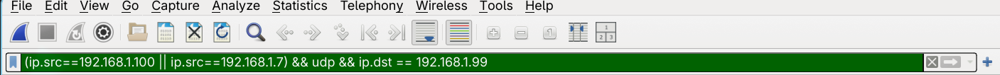
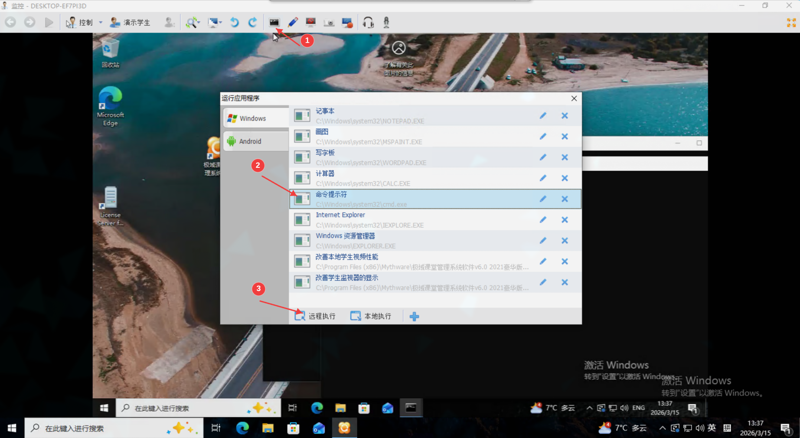

# ZakoMyth 不止吊打极域！还有你的同学awa！
通过笨蛋极域的**UDP重放漏洞**以"老师的名义"恶搞同学(
> 极域电子教室的学生端没有对接收到的UDP包进行身份验证，因此可以利用特定的数据包对学生端进行命令执行攻击

## 细说原理
怎么说呢...就好比老师让同学出去打扫卫生，此时同学当然会去打扫卫生，可是如果这个同学**不太聪明**的话,你仅仅需要模仿老师的口音和文字就可以让他认为你是老师，从而因为你去打扫卫生...

# 怎么模仿
那我就教教你怎么搞awa
## 环境搭建
**最简单的环境搭建方法就是去你们学校的机房awa 说服老师允许你用机房做一个可以搅乱机房的东西**
### jy
因为是获取jy的教师端给jy学生端发消息，这两个你至少要有吧(?)
> 下载这个东西的路子很多...没必要破解版的，试用30天就可以了，如果你30天做不出来的话...那就重新下载再用30天(bushi

我比较推荐虚拟机器...为什么呢？因为你需要监听"老师"是怎么给"学生"说的,在自己的虚拟网卡肯定更好监听嘛
### 监听
至于监听的话，[wireshark](https://www.wireshark.org/)我觉得是个好东西！
>可是你如果不知道怎么用的话...那你真是个
自己上网搜！

### 你的嘴巴
当然不是你的嘴巴，毕竟你不能给计算机说话，是一个能给其他主机**发送UDP数据包**的嘴巴，方法有很多，可能**Python**是最简单的？里面的socket库

## 抓包！监听！模仿！

### 设置过滤器
如果你用wireshark的话，刚打开对应网卡，一堆数据包冲了出来！很明显在茫茫大海中很难找到jy的数据包，这时就要过滤器出场了！

#### 过滤器在哪？

这就是过滤器！

在里面填上

**`(ip.src==192.168.1.100 || ip.src==192.168.1.7) && udp && ip.dst == 192.168.1.99`**

什么意思？

`ip.src==192.168.1.100 || ip.src==192.168.1.7`
>如果ip来源为192.168.1.100或者192.168.1.7
起中一个ip是教师机的ip,另一个是你的ip,一个是为了便于听数据包，另一个是为了验证自己发的数据包

`udp`
>只听udp协议的数据包，因为jy是这么说话的

`ip.dst == 192.168.1.99`
>数据包目标为192.168.1.99,即小白鼠的ip

这样设置完后，应该就清晰多了

## 说的什么？让我听听！
### 首先！老师让不太聪明的同学去打扫卫生！
这里就以打开cmd为例，这样操作

其中为了更好的探究这个数据包，我添加了一些标识

